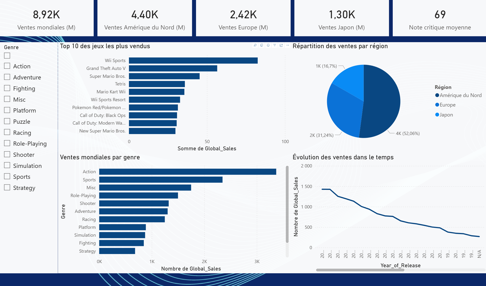

# 📊 Dashboard Power BI — Ventes de Jeux Vidéo

## Description
Analyse des ventes mondiales de jeux vidéo (1980-2016) sur 16 700 titres.
Dashboard interactif réalisé avec Power BI.

## Contenu
- Nettoyage et transformation des données avec Power Query
- Visualisations interactives sur 2 pages
- Filtres dynamiques par genre et plateforme

## Visualisations
- Top 10 des jeux les plus vendus
- Ventes mondiales par genre
- Évolution des ventes dans le temps
- Répartition des ventes par région (NA, EU, JP)
- Top 10 des plateformes et éditeurs

## Dashboard en ligne
[Voir le dashboard Power BI](https://app.powerbi.com/groups/me/reports/6b77e862-3e25-420b-947f-355942b93805/f28cfe6d63e0e06809ea?experience=power-bi)

## Outils
- Power BI Desktop
- Power Query
- Dataset : [Video Game Sales with Ratings](https://www.kaggle.com/datasets/rush4ratio/video-game-sales-with-ratings)
